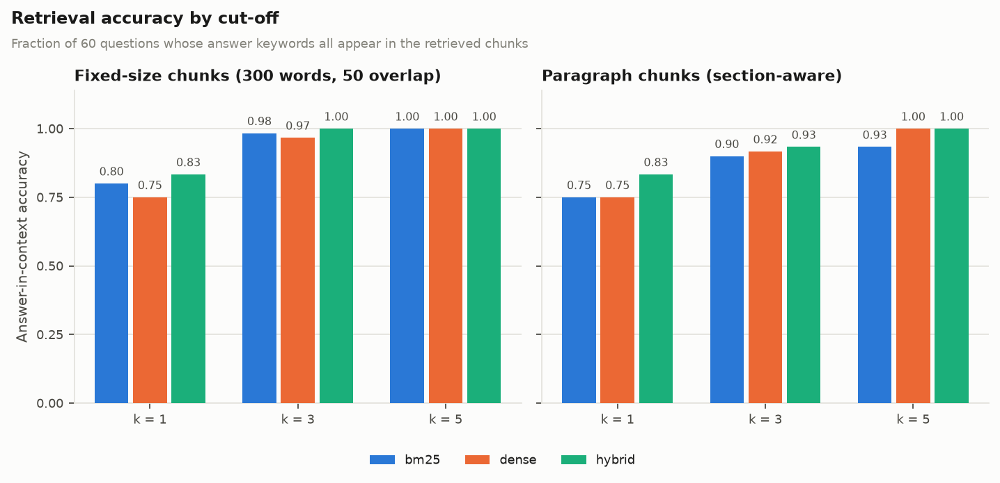
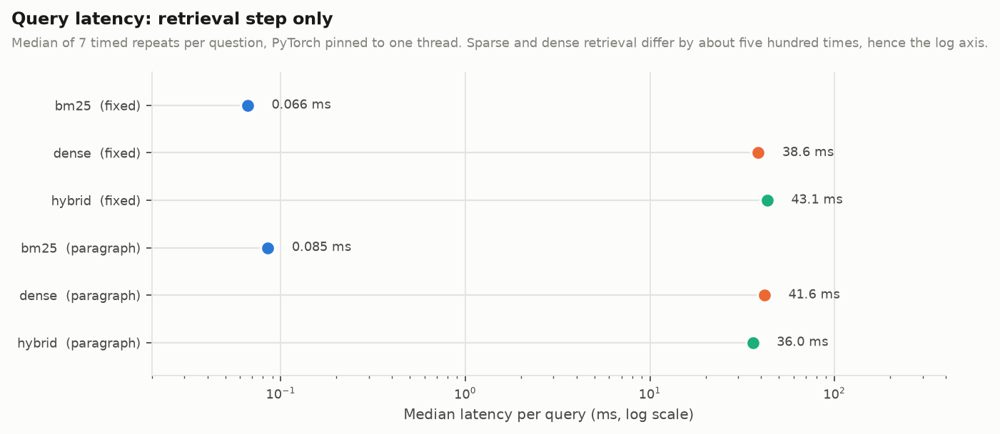
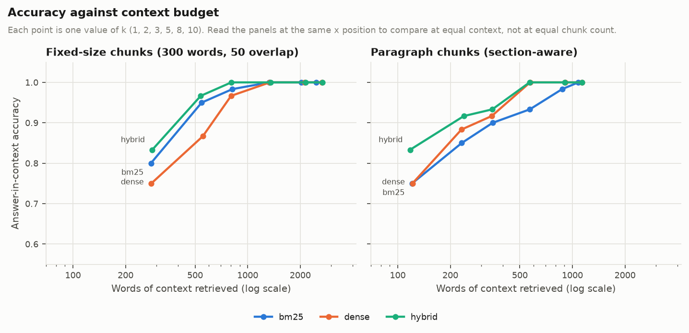

# Adaptive-RAG: Semantic Document Retrieval

**Anurag Jha and Sandesh Dhital**

---

## Contents

1. [Introduction](#1-introduction)
2. [RAG Background](#2-rag-background)
3. [Dataset and Documents](#3-dataset-and-documents)
4. [Document Processing](#4-document-processing)
5. [Chunking Methods](#5-chunking-methods)
6. [BM25 Retrieval](#6-bm25-retrieval)
7. [Dense Retrieval](#7-dense-retrieval)
8. [Hybrid Retrieval](#8-hybrid-retrieval)
9. [Experimental Setup](#9-experimental-setup)
10. [Results](#10-results)
11. [Discussion](#11-discussion)
12. [Limitations](#12-limitations)
13. [Conclusion](#13-conclusion)

---

## 1. Introduction

A language model can only reason about text it has been given. Asked about a
document it has never seen, it will either decline or invent an answer, and the
second failure is worse than the first because it is not obvious from the
output. Retrieval-augmented generation (RAG) addresses this by putting a search
step in front of the model: the question is used to find the passages most
likely to contain the answer, and those passages are supplied alongside the
question so that the model answers from evidence rather than from memory.

That makes retrieval the component that decides whether the whole system works.
A generator cannot use a fact it was never shown, so any passage the retriever
misses is a fact the system cannot report, no matter how capable the model is.
This project therefore concentrates on the retrieval half of RAG and asks a
question that has a measurable answer: given a small collection of documents,
which retrieval strategy finds the right passage, and which way of dividing the
documents into passages helps it do so?

Three retrieval strategies are implemented and compared:

- **BM25**, a sparse keyword method that scores a passage by the query terms it
  contains, weighted by how rare each term is across the collection;
- **dense retrieval**, which embeds passages and queries as vectors with a
  pretrained sentence-embedding model and ranks by cosine similarity;
- **hybrid retrieval**, which fuses the two rankings.

These are crossed with two ways of splitting documents into passages: a
fixed-size sliding window, and a structure-aware split on section headings and
paragraph boundaries. All six combinations are evaluated on the same sixty
annotated questions, and both retrieval quality and per-query latency are
measured, because a method that is slightly more accurate and a thousand times
slower is not automatically the better choice.

Two design commitments shape the code. First, BM25 is implemented directly
rather than imported, because the point of the exercise is to understand the
weighting, not to call it. Second, every reported number is produced by a
single command (`python scripts/run_experiments.py`) from the corpus and the
question set in this repository, so the results can be re-derived rather than
taken on trust.

The scope is deliberately modest. This is not a production RAG system: the
corpus is ten documents, the index fits in memory, and there is no reranking
stage, no query rewriting and no multi-turn conversation. The aim is a
comparison that is small enough to be measured carefully and explained
completely.

---

## 2. RAG Background

### 2.1 The problem retrieval solves

A language model has two sources of knowledge: whatever was in its training
data, and whatever is in its context window at the moment of the request. The
first is fixed at training time, has a cutoff date, and cannot include private
or organisation-specific documents. The second is what RAG uses.

The naive alternative — put every document in the context window — fails for
three reasons. Context windows are finite; cost and latency scale with the
number of tokens supplied; and accuracy degrades when the relevant sentence is
buried in a large volume of irrelevant text. Retrieval is what makes the
context window a useful place to put knowledge: it selects the small fraction
of the collection that bears on this particular question.

### 2.2 The stages of a RAG pipeline

A retrieval-augmented pipeline has an offline phase and an online phase.

**Offline (indexing).** Documents are loaded, their text is extracted and
normalised, they are split into chunks, and the chunks are indexed — as an
inverted index of terms for sparse retrieval, as a matrix of vectors for dense
retrieval, or both.

**Online (querying).** A question arrives; the retriever scores the chunks and
returns the top *k*; those chunks are formatted into a prompt with the question;
the generator produces an answer, ideally citing the chunks it used.

Each stage can fail independently, and the failures compound. If extraction
loses the text (a scanned PDF with no text layer), nothing downstream can
recover it. If chunking splits a fact away from the context needed to interpret
it, retrieval may return a passage that is topically right and practically
useless. If retrieval misses the passage, the generator has nothing to work
from. This project instruments the two stages in the middle, where the design
choices are least obvious.

### 2.3 Sparse and dense retrieval

**Sparse retrieval** represents a passage as a vector over the vocabulary, with
most entries zero. Matching is lexical: a query term contributes to a passage
only if that exact term (after stemming) occurs in it. The strengths follow
directly. Rare, precise terms — a chemical name, an error code, a proper noun —
are matched exactly and weighted heavily, so a query containing one is answered
with high precision. The index is small, scoring is arithmetic over an inverted
index, and there is no model to train or download. The weakness follows just as
directly: a passage that expresses the same idea in different words scores zero.
This is the *vocabulary mismatch* problem, and it is why a question phrased in
everyday language may fail against a technically worded document.

**Dense retrieval** represents a passage as a short vector — a few hundred
dimensions, all non-zero — produced by a model trained so that texts with
similar meanings land close together. Matching is by geometric proximity, so a
question and a passage can match with no words in common. The cost is that the
representation is lossy: a rare term that the model has little training signal
for is compressed into a general direction in the space, so dense retrieval can
be weaker than BM25 precisely where BM25 is strongest, on exact rare tokens. It
also requires a model, and encoding the query is orders of magnitude more work
than looking up terms in a dictionary.

**Hybrid retrieval** combines the two. The motivating observation is that the
failures are not the same failures: BM25 misses paraphrases, dense retrieval
blurs rare tokens, and a passage that both methods rank highly is more likely to
be right than one that only one of them favours. Fusion is where most of the
practical gain in retrieval systems has come from, and it is cheap: no
additional model, just a rule for combining two score vectors.

### 2.4 Why chunking matters

Retrieval returns chunks, so the chunk is the unit of both recall and
precision, and its size trades the two against each other.

A large chunk is more likely to contain the whole answer, including the context
needed to interpret it, so recall is high. But it also contains more irrelevant
text, which dilutes its representation: in BM25 the length normalisation
penalises it, and in a dense embedding a single sentence about the answer is
averaged with several hundred words about something else. A small chunk is
sharply focused and its embedding is a faithful summary of its content, but an
answer that spans two paragraphs may not fit in it, and the retriever must then
find both halves.

There is also a subtler effect. A fixed-size window cuts wherever the word count
runs out, which will sometimes be in the middle of a sentence and often in the
middle of an argument. A split that follows the structure the author already
imposed — sections, paragraphs — produces chunks that are self-contained units
of meaning. Whether that theoretical advantage shows up in measurements is one
of the questions this project answers.

---

## 3. Dataset and Documents

### 3.1 The corpus

The corpus is ten short documents written for this project, covering four broad
subject areas.

| File | `doc_id` | Topic area | Words |
| --- | --- | --- | --- |
| `01_photosynthesis.md` | `photosynthesis` | biology | 675 |
| `02_water_cycle.md` | `water_cycle` | earth science | 688 |
| `03_volcanoes.md` | `volcanoes` | earth science | 714 |
| `04_circulatory_system.md` | `circulatory_system` | biology | 689 |
| `05_antibiotics.md` | `antibiotics` | medicine | 654 |
| `06_apollo_programme.md` | `apollo_programme` | history of technology | 746 |
| `07_renewable_energy.md` | `renewable_energy` | engineering | 749 |
| `08_vaccination.md` | `vaccination` | medicine | 695 |
| `09_coral_reefs.md` | `coral_reefs` | marine science | 681 |
| `10_earthquakes.txt` | `earthquakes` | earth science | 770 |

Ten documents, 7,061 words in total, a mean of 706 words each and a narrow
range from 654 to 770. The uniform length is deliberate: it keeps BM25 length
normalisation from becoming a confound between documents, so that differences in
the results are attributable to the retrieval and chunking strategies rather
than to one document being much longer than the rest.

### 3.2 Why an authored corpus

Writing the corpus rather than downloading one was a deliberate choice with a
clear cost and a clear benefit.

The cost is that the corpus is small and its style is uniform, so results on it
generalise less readily than results on a public benchmark. The benefit is
control over the two things this experiment depends on. First, licensing and
reproducibility: the documents are in the repository, so the experiment runs
offline and the numbers can be re-derived by anyone with a checkout, with no
download step that might return different data later. Second, and more
importantly, the vocabulary overlap between documents is a designed property
rather than an accident.

That overlap matters because a corpus of ten unrelated documents makes retrieval
trivial: almost any method finds the right document from a single distinctive
keyword, and every strategy scores the same. The topics were therefore chosen to
overlap in specific places:

- **volcanoes and earthquakes** both discuss plate tectonics, subduction, faults
  and seismic waves;
- **coral reefs and the water cycle** both discuss the ocean, dissolved gases and
  climate;
- **photosynthesis and renewable energy** both discuss capturing light and
  converting energy;
- **antibiotics and vaccination** both discuss pathogens, immunity and public
  health;
- **the circulatory system and vaccination** both discuss white blood cells and
  antibodies.

These pairs are what give the evaluation its discriminating power, and they are
used explicitly by the "confusable" questions described in section 3.4.

### 3.3 File format

Nine documents are Markdown with `## ` section headings; `10_earthquakes.txt` is
plain text with no headings at all, so that the paragraph chunker is exercised on
a document whose only structure is its blank lines. Each file opens with a small
front matter block:

```
---
title: The Human Circulatory System
doc_id: circulatory_system
topic: biology
source: Adaptive-RAG teaching corpus (original text)
---
```

`doc_id` is the identifier the evaluation set refers to, so it is set explicitly
rather than derived from the filename, and it must stay stable if the files are
renamed.

PDF input is supported through the same interface: any PDF placed in
`data/documents/` is indexed, with text extracted by `pypdf`. The corpus itself
ships as text so that it stays diffable and reviewable in version control.
`python scripts/make_pdf_sample.py` renders one of the documents to a real PDF
and then checks that the text can be read back out again — 99.7% of the source
vocabulary is recovered, which confirms the ingestion path works rather than
merely assuming it does.

### 3.4 The evaluation set

Sixty questions were written over the corpus and stored in
`data/eval/questions.json`. Each carries the document or documents that contain
the answer, and a list of answer keywords taken verbatim from those documents.

```json
{
  "qid": "q16",
  "question": "Which node in the heart acts as the pacemaker?",
  "gold_doc_ids": ["circulatory_system"],
  "answer_keywords": ["sinoatrial node"],
  "kind": "lexical"
}
```

The questions are split into four kinds, chosen so that the strengths and
weaknesses discussed in section 2.3 are each exercised by a group of questions
rather than left to chance:

| Kind | Count | How it is written | What it probes |
| --- | --- | --- | --- |
| `lexical` | 20 | Reuses the vocabulary of the source | The case sparse retrieval is built for |
| `paraphrased` | 20 | Deliberately avoids the wording of the source | Vocabulary mismatch |
| `multi_hop` | 10 | Needs material from two different sections | Whether a chunk holds enough context |
| `confusable` | 10 | Strongest keywords point at a document that does *not* hold the answer | Whether a method is misled by surface overlap |

A paraphrased question asks "Why is the far side of a mountain range drier than
the side the wind hits?" where the document says "rain shadow"; a confusable one
asks "Which small tremors give warning that magma is forcing a path upward?",
where the words *tremors* and *earthquakes* point at the earthquakes document
while the answer is in the volcano monitoring section. One question
(`q59`, on the leaf openings that admit carbon dioxide and release water vapour)
is genuinely answered by two documents and is annotated with both, which
exercises recall over more than one gold document.

The keywords are the basis of the accuracy metric, so the evaluation set has to
be *achievable*: if a keyword did not occur in the document it is attributed to,
no retriever could ever score it, and the metric would have an invisible
ceiling below 1.0. This is asserted by a test
(`test_every_keyword_is_present_in_its_gold_document`) that stems both sides and
checks each keyword against the full text of each of its gold documents. All
sixty questions pass, so a perfect retriever would score exactly 1.0.

---

## 4. Document Processing

Extraction is the stage where information is lost silently, so the processing
steps are deliberately conservative: they repair damage introduced by file
formats without discarding anything a retriever might use.

### 4.1 Extraction

`loaders.py` dispatches on file suffix. Markdown and text files are read
directly and their front matter is separated from the body. PDFs are read
page by page with `pypdf` and the pages are joined with blank lines; document
metadata is taken from the PDF info dictionary when present. A file that
produces no text raises `DocumentLoadError` rather than being indexed as an
empty document, because an empty document is a silent failure — it never
matches anything, and nothing in the results indicates why.

### 4.2 Normalisation

Three transformations are applied, each fixing an artefact that would otherwise
corrupt retrieval:

1. **Paragraph structure is preserved; line wrapping is not.** A single newline
   inside a paragraph is joined into a space, while a blank line is kept as a
   paragraph break. This matters because the paragraph chunker relies on blank
   lines to find its boundaries: if hard-wrapped source lines were treated as
   paragraph breaks, every line of the corpus would become its own chunk.

2. **Hyphenated line breaks are repaired.** PDF extraction commonly yields
   `photo-\nsynthesis`, which tokenises as two terms, neither of which matches
   `photosynthesis`. The pattern `(\w)-\n(\w)` is rejoined.

3. **Runs of blank lines are collapsed** to exactly one, so that inconsistent
   spacing in the source does not change the chunk boundaries.

Markdown headings are kept on their own line during normalisation so that
section detection still works, and the heading *words* are retained in the chunk
body with only the `##` syntax removed. A heading such as "Bleaching and Thermal
Stress" is a strong lexical signal about the passage beneath it, and discarding
it would throw away exactly the terms a query is most likely to use.

### 4.3 Preprocessing for lexical retrieval

Only BM25 uses `preprocess.py`; dense retrieval is given the raw text, because
the embedding model was trained on natural language and stripping stopwords from
its input removes signal it expects.

**Tokenisation** lowercases and matches `[a-z0-9]+(?:[-'][a-z0-9]+)*`, which
keeps hyphenated technical terms — `crown-of-thorns`, `beta-lactamase`,
`shockley-queisser`, `ninety-seven` — as single tokens. Splitting them would
turn a distinctive term into a handful of common ones and lose the precision
that sparse retrieval exists to provide.

**Stopword removal** uses a compact list of about 120 function words. Terms that
carry retrieval signal in this corpus are intentionally left out of the list: no
numerals are removed (`nine days`, `ninety-seven per cent` are answers), and
neither is `not`.

**Stemming** is a short list of suffix rules applied in stages — plurals, then
verb inflection, then a few derivational endings — rather than a full Porter
implementation. It adds no dependency and is short enough to explain, and it
resolves the inflections that matter here: a question about *eruptions* matches
a passage that says a volcano *erupts*, and *waves* matches *wave*.

Getting that last case right required care. An early version stripped `-es` from
`waves` to give `wave`, but left the singular `wave` untouched, so the two forms
never matched and the stemmer actively hurt the recall it was meant to improve.
The fix is a final step that removes a silent trailing `e`, so both forms reduce
to `wav`. The general lesson is that a stemmer only needs to be *consistent*,
not linguistically correct: it is a hash function whose only requirement is that
related forms collide. The suite tests eight plural pairs and eight inflection
pairs for exactly this property.

One known limitation remains: a singular noun already ending in `s` is
over-stemmed (`virus` becomes `viru` while `viruses` becomes `virus`), so the two
do not match. This affects a handful of words, the full Porter stemmer has the
same behaviour, and the evaluation keywords are taken verbatim from the
documents so they are unaffected.

---

## 5. Chunking Methods

Both strategies implement the same `Chunker` interface, so they are
interchangeable everywhere downstream and the experiment can hold everything
else fixed while swapping them.

### 5.1 Fixed-size chunking

A sliding window over the word sequence: 300 words per chunk with a 50-word
overlap, as specified in the brief, giving a stride of 250 words.

The overlap exists to limit boundary damage. With no overlap, a fact that
straddles a cut is split in two and may be retrievable from neither half; with a
50-word overlap, any span of 50 words or fewer appears intact in at least one
chunk. The cost is duplication: with a stride of 250 and a window of 300, one
word in six is stored twice, which is visible in the measured chunk statistics
as 1.14 times the corpus word count.

Two details are worth noting. Ties in the word count are handled by dropping a
final window no longer than the overlap, because such a window contains nothing
that the previous window does not already contain; emitting it would add an
index entry with no new information. And a document shorter than the window
becomes a single chunk rather than a padded one.

Applied to the corpus, this yields **30 chunks**, mean 268 words, median 299,
range 154 to 300. The median sits at the window size because most windows are
full; the short chunks are the final window of each document.

### 5.2 Paragraph chunking

The brief calls this the semantic strategy, and it is worth being precise about
what is and is not being claimed. This is not embedding-based semantic
segmentation, where consecutive sentences are embedded and a boundary is placed
where the similarity drops. It is a simpler idea with much of the same benefit:
*the author has already marked the semantic boundaries*, as section headings and
paragraph breaks, and the chunker respects that structure instead of imposing a
word count on top of it.

The implementation proceeds in three passes:

1. **Split on blank lines, attaching headings.** A heading on its own is not a
   useful chunk, so it is prefixed to the first paragraph of its section, and the
   section name is propagated onto every later paragraph in that section. This
   propagation is what makes a paragraph that says "The interval between the
   arrival of the P wave..." retrievable by a query about *seismic waves* even
   though the paragraph never repeats the section title.

2. **Merge undersized blocks.** A block shorter than 80 words is merged forward
   into the next one, because a 20-word paragraph rarely contains enough context
   to answer anything and mostly adds noise to the index.

3. **Split oversized blocks at sentence boundaries.** A block longer than 350
   words is divided at sentence ends, never mid-sentence, so no chunk is
   unusably large and none is truncated mid-clause.

Applied to the corpus, this yields **64 chunks**, mean 112 words, median 99,
range 79 to 200, and total 1.01 times the corpus word count — essentially no
duplication, since paragraphs are stored once.

### 5.3 The comparison is not size-controlled, and that matters

The two strategies produce chunks of very different sizes: 268 words on average
against 112. Retrieving the top 5 chunks therefore hands the generator about
1,340 words under fixed chunking and about 570 under paragraph chunking — a
factor of 2.4.

This is not a defect in either chunker; it is what the strategies do. But it
means that comparing them at the same *k* also compares them at very different
context budgets, and a naive reading would credit fixed-size chunking for
accuracy it obtained simply by returning more text. Two steps address this:

- the words of context retrieved are recorded as a metric
  (`context_words@k`) and reported in every results table, so the budget is
  never invisible;
- accuracy is swept across *k* for every configuration and reported against the
  context volume it costs, so the two strategies can be compared at a matched
  budget rather than a matched chunk count.

Section 11 reads the comparison both ways, and they do not give the same answer.

---

## 6. BM25 Retrieval

### 6.1 The scoring function

BM25 scores a chunk `d` against a query `q` as

```
score(q, d) = sum over terms t in q of
              IDF(t) · f(t,d) · (k1 + 1)
              -------------------------------------------
              f(t,d) + k1 · (1 - b + b · |d| / avgdl)
```

where `f(t,d)` is the frequency of term `t` in chunk `d`, `|d|` is the length of
`d` in tokens, and `avgdl` is the mean chunk length. The inverse document
frequency is

```
IDF(t) = ln( 1 + (N - n(t) + 0.5) / (n(t) + 0.5) )
```

with `N` the number of chunks and `n(t)` the number containing `t`.

Three ideas are encoded in that expression, and each is testable.

**Rare terms are worth more.** IDF grows as `n(t)` falls, so a term appearing in
one chunk contributes far more than one appearing in half of them. The suite
asserts `IDF(chromodynamics) > IDF(cats)` on a toy corpus where the second term
appears in two chunks and the first in one.

**Repetition saturates.** The term frequency appears in both numerator and
denominator, so the contribution approaches `IDF(t) · (k1 + 1)` as `f(t,d)`
grows. A chunk mentioning a term twenty times is not ranked twenty times higher
than one mentioning it once — an important property, because raw term frequency
is trivially gamed by repetition and, in ordinary prose, the difference between
one mention and five is far more informative than between fifteen and twenty.
`k1 = 1.5` controls how quickly this saturation sets in.

**Long chunks are penalised.** The `b · |d| / avgdl` factor increases the
denominator for chunks longer than average. Without it, a long chunk would score
well on almost any query simply by containing more words. `b = 0.75` is the
standard setting; `b = 0` disables normalisation entirely, and the suite verifies
both ends: with `b = 0.75` a one-word chunk containing `seismograph` outranks a
200-word chunk containing it once, and with `b = 0` the two score identically.

The `1 +` inside the logarithm is the form that keeps IDF positive even for a
term occurring in every chunk. The textbook form without it goes negative in
that case, which lets a common term *reduce* a score — an effect that is
surprising to debug and has no useful interpretation. A test asserts that a term
present in all five chunks of a toy corpus still has positive IDF.

### 6.2 Implementation

Indexing tokenises each chunk, records its length, and builds an inverted index
mapping each term to the list of `(chunk index, term frequency)` pairs in which
it appears. IDF is computed once per term at index time.

Scoring walks the postings lists of the query terms only, so chunks sharing no
term with the query are never visited. On a corpus this size that is an
irrelevant optimisation, but it is the reason sparse retrieval scales: cost
depends on the number of chunks containing the query terms, not on the size of
the collection.

Two methods exist for inspection rather than for retrieval. `term_idf` exposes
the weight of a single term, and `explain(query, chunk_index)` returns the
per-term contributions to one chunk's score, sorted by size. The second is what
makes a surprising ranking diagnosable: it answers "which term put this chunk
here?", and it is used for the error analysis in section 11.

BM25 returns only chunks with a non-zero score. A chunk sharing no term with the
query has score exactly zero, and including it would be padding a result list
with items the method has positively identified as irrelevant.

---

## 7. Dense Retrieval

### 7.1 Embeddings

Chunks and queries are encoded with `sentence-transformers/all-MiniLM-L6-v2`, a
six-layer transformer with about 22 million parameters that produces 384-
dimensional vectors. It was chosen for its size: it runs on a laptop CPU in a
few tens of milliseconds per query, which keeps the whole experiment
reproducible without a GPU, and it is a genuinely pretrained sentence encoder
rather than an approximation of one.

All vectors are L2-normalised at encoding time. This is not cosmetic: once every
vector has unit length, the cosine similarity between two of them is exactly
their inner product, so the similarity computation is a single matrix product
and the NumPy and FAISS code paths are guaranteed to agree.

### 7.2 A fallback backend

Installing `sentence-transformers` pulls in PyTorch, which is a large download
and is not always available. A second backend, `LsaBackend`, sits behind the same
interface and needs only NumPy and scikit-learn: TF-IDF with unigrams and
bigrams, followed by truncated SVD to 256 dimensions — that is, latent semantic
analysis.

This is a real dense vector space and it exercises the same code path, but it is
fitted on the corpus being indexed rather than pretrained on a large text
collection, so it has no knowledge of paraphrases it has not seen in these ten
documents. It is a compatibility fallback, not a competitor: all reported
results use the pretrained model, and the backend actually used is recorded in
`results.json` so the two can never be silently confused.

### 7.3 Search

Two search paths are implemented and both are exact.

The NumPy path multiplies the `(n_chunks × 384)` matrix by the query vector and
takes the top *k*. The FAISS path uses `IndexFlatIP`, an exhaustive
inner-product index. `Flat` is the important word: this is a brute-force search,
not an approximate one, so it returns the same ranking as the matrix product.
The approximate FAISS index types (IVF, HNSW) trade recall for speed and only
begin to pay off at collection sizes far beyond this project; using one here
would introduce a second source of error for no benefit. FAISS is therefore
included because it is the standard tool for this job and the interface is worth
demonstrating, and a test asserts that the two paths return identical chunk
identifiers and scores to within 1e-5.

Unlike BM25, dense retrieval always returns *k* results. Cosine similarity is
defined for every pair of vectors and can legitimately be negative, so there is
no principled zero threshold below which a chunk is "not a match". This is a
real behavioural difference between the two methods: asked something the corpus
does not cover, BM25 returns nothing while dense retrieval returns its five
least-unrelated chunks. Neither is right in general, but it is why the extractive
generator has its own check for whether the retrieved text actually addresses the
question.

---

## 8. Hybrid Retrieval

BM25 scores are unbounded and depend on IDF and chunk length; cosine
similarities lie in [-1, 1]. Adding them directly would let whichever happens to
have the larger numeric range dominate, so fusion needs an explicit rule. Two
are implemented.

### 8.1 Weighted score fusion

Each score vector is min-max normalised onto [0, 1] across the corpus, and the
results are combined as

```
combined = alpha · dense_norm + (1 - alpha) · bm25_norm
```

`alpha = 0` reproduces BM25 exactly, `alpha = 1` reproduces dense retrieval, and
`alpha = 0.5` weights them equally. Those two limits are asserted by tests,
which is the cheapest available guard against a fusion bug: a rule that does not
degenerate correctly at its endpoints is wrong somewhere in the middle too.

Normalisation is computed over the whole corpus rather than over each retriever's
top candidates. On a corpus of a few dozen chunks both score vectors are
computed in full anyway, and normalising over the full range avoids an asymmetry
that appears in the candidate-restricted version: a chunk ranked highly by one
retriever but absent from the other's candidate list has no defined normalised
score from the second, and whatever value is imputed for it is arbitrary. On a
large corpus the candidates would have to be restricted for cost reasons, and
the asymmetry accepted.

A constant score vector normalises to all zeros rather than producing a division
by zero, which is the case that arises when a query matches no term at all.

### 8.2 Reciprocal rank fusion

The alternative discards the scores and uses only positions:

```
combined = sum over retrievers of 1 / (rrf_k + rank)
```

with `rrf_k = 60` and each retriever contributing its top 20 candidates. Because
only ranks enter, the rule is scale-free and needs no normalisation at all,
which makes it the more robust choice when the score distributions are unknown
or unstable. Its weakness is the mirror image: it cannot express a preference
between the two signals, and it discards the information that one chunk scored
far higher than the next rather than just slightly higher.

Score fusion is the default because `alpha` is the parameter this project wants
to study; RRF is implemented, tested, and available as `--fusion rrf`.

### 8.3 Sharing the components

A `HybridRetriever` holds a `BM25Retriever` and a `DenseRetriever` and will reuse
them if they are already indexed over the same chunks. This is why the
experiment encodes the corpus twice — once per chunking strategy — rather than
four times: the dense index built for the dense run is handed to the hybrid run.
Encoding is the dominant cost of building the index, so this roughly halves the
runtime of the grid, and a test asserts that the shared embedding matrix is not
rebuilt.

---

## 9. Experimental Setup

### 9.1 The grid

Two chunking strategies × three retrievers = six configurations, each evaluated
on all sixty questions. Every configuration sees exactly the same documents and
the same questions; the only things that vary are the chunker and the retriever.

### 9.2 Metrics

Relevance is judged **at document level**: a retrieved chunk counts as relevant
if it comes from a document annotated as containing the answer. Chunk-level
relevance judgements would be preferable but are not practical here, because each
chunking strategy produces a different set of chunks and the labels would have to
be redone for each; document-level labels stay valid however the text is split,
which is precisely what a comparison of chunking strategies requires.

| Metric | Definition | What it tells us |
| --- | --- | --- |
| **Hit@k** | 1 if any of the top *k* chunks is from a gold document | Did the retriever find the topic at all? |
| **Precision@k** | Fraction of the top *k* that are relevant | How much of the context is wasted? |
| **Recall@k** | Fraction of gold documents represented in the top *k* | Matters for the multi-document question |
| **MRR** | Reciprocal of the rank of the first relevant chunk | How well is the best result ranked? |
| **nDCG@k** | Discounted cumulative gain, binary relevance, normalised | Rewards relevant chunks appearing earlier |
| **Answer-in-context@k** | 1 if *every* annotated answer keyword appears in the top *k* chunks | Could a generator answer from this context? |
| **Context words@k** | Total words in the top *k* chunks | The cost of that context |

**Answer-in-context is the headline "accuracy" figure**, for a specific reason.
The document-level metrics ask whether the retriever found the right *topic*,
which on a ten-document corpus is not a demanding question. Answer-in-context
asks whether the retrieved text actually contains the facts needed to answer,
which is the only property the downstream generator can use — it cannot cite
what it was not shown. It is also the only metric here that is sensitive to
chunking in the right way: it rewards a chunk that holds a complete answer and
penalises one that holds half of it.

Keywords are matched on stemmed tokens, and a multi-word keyword must appear as a
contiguous token sequence, so "rain shadow" is not satisfied by a passage
mentioning rain in one sentence and a shadow in another. A question with no
annotated keywords yields an undefined value that is excluded from that metric
only, rather than from the whole row.

### 9.3 Latency

Latency is measured on the **retrieval step alone** — no generation — because
generation cost is a property of the language model, identical across the three
retrievers, and would swamp the difference being measured.

Each question is timed seven times after five warm-up queries. The warm-up
matters: the first call to a dense retriever pays for lazy imports, memory
allocation and the first forward pass through the model, none of which are
representative of steady-state behaviour.

Getting a trustworthy number here took more care than expected, and the process
is worth recording. An early run reported a mean latency of 2,455 ms for one
configuration whose median was 29 ms. The cause was a single query that took 144
seconds — an operating-system stall on a shared laptop, not a property of the
retriever, but enough to move the mean of 420 samples by two orders of
magnitude. Three changes followed:

- **PyTorch is pinned to one thread** during timing. Left unpinned, the intra-op
  thread pool made repeated identical calls vary by an order of magnitude, which
  swamped the difference between the methods being compared. One thread is also a
  reasonable model of how a service under concurrent load executes a single
  query.
- **The median is the reported figure**, with the raw mean shown next to it as a
  check rather than suppressed.
- **Stalls are counted and declared.** `LatencySummary` records how many samples
  exceed ten times the run's own median, and the results file prints an explicit
  measurement warning naming any run affected. A trimmed mean is also reported.

The point is not that the median is a better statistic in general, but that a
mean over samples containing an unmodelled stall is not measuring what it claims
to. Reporting it without comment would have been the error.

### 9.4 Sweeps

Two sensitivity analyses accompany the main grid.

The **alpha sweep** evaluates hybrid retrieval at `alpha` from 0 to 1. Since the
endpoints are exactly BM25 and exactly dense retrieval, the sweep answers
directly whether fusion beats both of its components or merely interpolates
between them — the question that decides whether hybrid retrieval is worth its
extra cost.

The **k sweep** evaluates every configuration at *k* = 1, 2, 3, 5, 8, 10 and
records the context volume at each, which is what allows the two chunking
strategies to be compared at a matched context budget rather than a matched
chunk count (section 5.3).

### 9.5 Reproducibility

Everything is deterministic. There is no sampling in retrieval; ties are broken
by chunk order so repeated queries return identical rankings, and the SVD in the
fallback backend is seeded. Two tests assert this directly, one on repeated
searches and one on a corpus of identical chunks.

`results.json` records the Python and library versions, the platform, the
thread pinning, the embedding backend actually used, and whether FAISS was
available, so a future run that disagrees can be compared against the conditions
of this one.

Measured on: Windows 11, Python 3.13.3, NumPy 2.5.3, scikit-learn 1.9.0,
PyTorch 2.14.0+cpu, sentence-transformers 6.0.1, FAISS 1.15.0.

---

## 10. Results

All numbers below were produced by `python scripts/run_experiments.py` and are
reproduced in full in [`results/results.md`](../results/results.md), with
per-question outcomes in `results/per_query.csv`.

### 10.1 The retriever comparison

Sixty questions, ten documents. Accuracy is answer-in-context; latency is the
median of seven timed repeats per question on the retrieval step only.

| Retrieval | Chunking | Accuracy@1 | Accuracy@3 | Accuracy@5 | Hit@1 | MRR | Median latency | p95 latency |
| --- | --- | --- | --- | --- | --- | --- | --- | --- |
| BM25 | fixed | 0.800 | 0.983 | **1.000** | 0.950 | 0.971 | **0.066 ms** | 0.119 ms |
| BM25 | paragraph | 0.750 | 0.900 | 0.933 | 0.967 | 0.978 | 0.085 ms | 0.154 ms |
| Dense | fixed | 0.750 | 0.967 | **1.000** | 0.967 | 0.974 | 38.6 ms | 120.7 ms |
| Dense | paragraph | 0.750 | 0.917 | **1.000** | 0.983 | 0.989 | 41.6 ms | 129.2 ms |
| Hybrid | fixed | **0.833** | **1.000** | **1.000** | **1.000** | **1.000** | 43.1 ms | 130.8 ms |
| Hybrid | paragraph | **0.833** | 0.933 | **1.000** | **1.000** | **1.000** | 36.0 ms | 51.6 ms |

Three things stand out.

**Hybrid retrieval is first or joint-first on every quality metric, in both
chunking regimes.** It is the only configuration that reaches Hit@1 = 1.000 and
MRR = 1.000: with either chunker, hybrid retrieval put a chunk from the correct
document at rank one for all sixty questions.

**BM25 is about 500 times faster.** 0.066 ms against 38.6 ms per query with
fixed chunks, a ratio of 584. Almost all of the dense cost is the forward pass
that encodes the query, which is why hybrid retrieval costs essentially what
dense retrieval costs — it adds a BM25 scan worth well under a tenth of a
millisecond — rather than the sum of the two.

**Accuracy@5 is saturated.** Five of six configurations score exactly 1.000, and
Hit@5 and Recall@5 are 1.000 for all six. On ten well-separated documents,
retrieving five chunks is enough for every method, so k = 5 does not
discriminate and the informative comparisons are at k = 1 and k = 3.





### 10.2 Indexing cost

| Retriever | Fixed (30 chunks) | Paragraph (64 chunks) |
| --- | --- | --- |
| BM25 | 0.014 s | 0.009 s |
| Dense | 14.9 s | 21.6 s |
| Hybrid | 16.9 s | 16.1 s |

The asymmetry is even larger than at query time: building the BM25 inverted
index over the whole corpus takes about a hundredth of a second, while encoding
the same corpus with the transformer takes fifteen to twenty seconds on one CPU
thread. The BM25 index holds 1,817 distinct terms, averaging 164 tokens per
fixed chunk and 69 per paragraph chunk after stopword removal and stemming.

### 10.3 Accuracy by question type

Answer-in-context@3, the cut-off at which the methods still differ:

| Chunking | Retriever | Lexical | Paraphrased | Multi-hop | Confusable | All |
| --- | --- | --- | --- | --- | --- | --- |
| fixed | BM25 | 1.000 | 0.950 | 1.000 | 1.000 | 0.983 |
| fixed | Dense | 1.000 | 0.950 | 1.000 | 0.900 | 0.967 |
| fixed | Hybrid | 1.000 | **1.000** | 1.000 | 1.000 | **1.000** |
| paragraph | BM25 | 1.000 | 0.850 | 0.700 | 1.000 | 0.900 |
| paragraph | Dense | 1.000 | 0.900 | 0.700 | 1.000 | 0.917 |
| paragraph | Hybrid | 1.000 | **0.950** | 0.700 | 1.000 | **0.933** |

Every method answers the twenty lexical questions perfectly, which is the
expected result and confirms that the questions are answerable. The differences
are concentrated in the paraphrased group, where hybrid retrieval is best in
both regimes, and in the multi-hop group, where paragraph chunking loses three
of ten questions regardless of retriever — a chunking failure that no retriever
recovers from.

### 10.4 The chunking comparison depends on how you measure it

At equal *k*, fixed-size chunking looks clearly better: 0.983 against 0.900 on
answer-in-context@3 for BM25. But at k = 5 it also hands the generator 1,328
words of context against 570, which is 2.3 times as much. Sweeping *k* and
reading accuracy against the words retrieved gives a different answer:

| Context retrieved | Fixed chunks | Paragraph chunks |
| --- | --- | --- |
| ~120 words | — | 0.750 (dense, k=1) |
| ~280 words | 0.750 (dense, k=1) | — |
| ~345 words | — | 0.917 (dense, k=3) |
| ~554 words | 0.867 (dense, k=2) | — |
| ~573 words | — | **1.000** (dense, k=5) |
| ~804 words | 0.967 (dense, k=3) | — |
| ~909 words | — | 1.000 (dense, k=8) |
| ~1,340 words | 1.000 (dense, k=5) | — |

At roughly 560 words of context, paragraph chunking with dense retrieval scores
1.000 while fixed chunking scores 0.867. Paragraph chunking reaches perfect
accuracy on about 573 words; fixed chunking needs about 1,340 to do the same, a
factor of 2.3 more context for the same result. The same pattern holds for
hybrid retrieval, and it is roughly neutral for BM25 (0.933 at 570 words against
0.950 at 545).



Precision@5 tells the same story from another angle: 0.827 for paragraph and
dense retrieval against 0.570 for fixed and dense. Paragraph chunks waste far
less of the context window on text that is not relevant.

### 10.5 The alpha sweep

Hybrid retrieval with paragraph chunks, varying the dense weight. `alpha = 0` is
exactly BM25 and `alpha = 1` is exactly dense retrieval, so the endpoints are
the two components and everything between them is genuine fusion:

| alpha | Accuracy@5 | MRR | nDCG@5 |
| --- | --- | --- | --- |
| 0.0 (pure BM25) | 0.933 | 0.978 | 0.960 |
| 0.2 | 0.983 | 0.988 | 0.975 |
| 0.4 | **1.000** | **1.000** | 0.982 |
| 0.5 | **1.000** | **1.000** | 0.988 |
| 0.6 | **1.000** | **1.000** | 0.986 |
| 0.8 | **1.000** | **1.000** | **0.989** |
| 1.0 (pure dense) | **1.000** | 0.989 | 0.979 |

MRR is the informative column, because accuracy saturates. It is 0.978 at one
endpoint and 0.989 at the other, and 1.000 across the whole interval from
alpha = 0.4 to 0.8. Fusion is therefore not merely interpolating between its
components: over a broad middle range it is strictly better than either of them,
and the result is not sensitive to the exact weight, which matters because it
means `alpha` does not need careful tuning to obtain the benefit.

### 10.6 Where each method fails

The most informative result is not any aggregate but which questions each method
gets wrong. Taking Hit@1 with fixed chunks, the failures are:

| Method | Questions failed at rank 1 |
| --- | --- |
| BM25 | q04, q09 (paraphrased), q53 (confusable) |
| Dense | q34 (paraphrased), q56 (confusable) |
| Hybrid | none |

**The two failure sets are disjoint.** No question defeats both BM25 and dense
retrieval, and hybrid retrieval answers all five that defeat one of them. The
same holds for paragraph chunks: BM25 fails q09 and q54, dense fails q34, and
hybrid fails nothing.

---

## 11. Discussion

### 11.1 Why hybrid retrieval wins, and how confident we can be

Section 10.6 is the mechanism behind every hybrid result in this report. The
case for fusion is usually stated as "the two methods are complementary", which
is easy to assert and hard to see. Here it is directly visible: the five
questions that defeat one component are answered by the other, and none defeats
both.

Individual cases make the complementarity concrete.

**q09 — "How long does a single water molecule usually stay up in the air?"**
The document says that "the average residence time of a water molecule in the
atmosphere ... is only about nine days". BM25 ranks a chunk of the *volcanoes*
document first. The question shares only common words with the passage that
answers it, while the terms that would identify that passage — *residence*,
*atmosphere* — do not appear in the question at all. This is vocabulary mismatch
in its purest form, and dense retrieval handles it because "stay up in the air"
and "residence time in the atmosphere" are close in embedding space despite
sharing no content words.

**q34 — "Which figure compares what a plant actually produces in a year with
running flat out all year?"** Dense retrieval ranks *photosynthesis* first. The
culprit is the word *plant*: the question means a power station, the embedding
model resolved it towards vegetation, and the surrounding words *produces* and
*year* did nothing to disambiguate it. BM25 gets this right because it does not
attempt to interpret *plant* at all. This is the sharpest illustration in these
results of what a dense representation costs: it is lossy in exactly the way
that makes polysemy dangerous.

**q53 — "How does dissolved carbon dioxide change the acidity of seawater?"**
BM25 ranks the *circulatory system* document first, because that document
discusses dissolved carbon dioxide at length, as hydrogencarbonate in blood
plasma. Every keyword matches and the topic is still wrong. Dense retrieval is
not fooled, because *seawater* and *acidity* place the query firmly in the
marine region of the space.

**q56 — "What is the slow first reaction to an infection that takes one or two
weeks to build?"** Dense retrieval ranks *antibiotics* first: the question is
about infection and immune response, and the two medical documents are close
neighbours. BM25 finds *vaccination*, because "primary response" and "one to two
weeks" match lexically.

The pattern in all four is the same. BM25 fails when the answer is expressed in
different words, or when the right words appear in the wrong document. Dense
retrieval fails when a rare or ambiguous term needs to be taken literally.
Fusion helps because a chunk needs support from only one of the two signals to
be promoted, while a chunk that is a false positive under one signal is rarely
also a false positive under the other.

**How confident should we be?** Less than the tables alone suggest. A paired
exact sign test on the discordant questions gives, for Hit@1 with fixed chunks,
hybrid better than BM25 on three questions and worse on none (p = 0.25), and
hybrid better than dense on two and worse on none (p = 0.50). With sixty
questions, a 95% confidence interval on a proportion near 0.83 is about ±0.09,
which is wider than most of the differences in section 10.1. **No pairwise
difference in this report is statistically significant on its own.**

What can be claimed is narrower but still substantive: across two chunking
regimes and every quality metric measured, hybrid retrieval never lost a single
question to either of its components, and it recovered every question that one
of them lost. The direction is perfectly consistent, and the mechanism is
identified and inspectable. That is evidence about *why* fusion helps rather
than proof of *how much*; quantifying the effect would need a larger question
set.

### 11.2 Chunking: the comparison reverses under a fair budget

The chunking result is the one where measurement design changed the conclusion,
and it is worth being explicit about that, because the naive comparison is the
one most likely to be reported.

At equal *k*, fixed-size chunking wins on answer-in-context (0.983 against 0.900
at k = 3 for BM25). Reading only that, the recommendation would be to use
fixed-size chunks. But at equal *k* the two strategies are not doing equal work:
a fixed chunk averages 268 words and a paragraph chunk 112, so k = 3 retrieves
818 words in one case and 350 in the other. Fixed-size chunking is partly being
credited for accuracy it obtained by returning more than twice as much text.

Once the comparison is made at a matched context budget, the ordering reverses
for dense and hybrid retrieval: paragraph chunking reaches accuracy 1.000 on
about 573 words, while fixed chunking needs about 1,340 words for the same
score. Precision@5 shows the same effect directly, 0.827 against 0.570.

The mechanism is straightforward. A dense embedding of a 268-word chunk is a
single vector summarising several topics, so a passage about the answer is
averaged with a few hundred words about something else; the embedding of a
112-word paragraph is a much more faithful summary of one idea. BM25 is largely
indifferent, because its length normalisation already discounts long chunks
explicitly, which is why the benefit of tighter chunks appears for dense and
hybrid retrieval but not for sparse.

Whether this matters in practice depends on what is scarce. If the constraint is
the context window or the per-token cost of the generator, which is the usual
case, then paragraph chunking is clearly preferable, because it buys the same
accuracy for less than half the context. If the constraint is the number of
retrieval calls, fixed chunks reach a given accuracy in fewer of them.

### 11.3 The cost of paragraph chunking: multi-hop questions

Paragraph chunking has one clear and consistent weakness. It scores 0.700 on the
ten multi-hop questions at k = 3 against 1.000 for fixed chunking, and the
figure is identical for all three retrievers. When a chunking choice costs the
same three questions no matter which retriever is used, the failure belongs to
the chunking.

The cause is visible in the failing questions. q15 asks where silica-rich magma
is generated *and* which hazard it produces, with the answer keywords
`subduction` and `pyroclastic`; q50 asks which fault type produces the largest
earthquakes *and* which waves cause most of the damage, with keywords `thrust`
and `surface waves`. In each case the two facts sit in different sections of the
same document. A 268-word fixed chunk with 50 words of overlap frequently spans
a section boundary and catches both; a 112-word paragraph chunk cannot, so the
retriever must independently rank *two* different chunks into the top three. At
k = 5 the paragraph runs recover, and dense and hybrid reach 1.000.

This is a genuine trade-off rather than a defect. Small chunks are more precise
per word and worse at spanning; large chunks are the reverse. The practical
implication is that the right chunk size depends on whether the expected
questions are answered by one passage or by several, which is a property of the
question distribution and not something a chunker can determine on its own.

### 11.4 Is hybrid retrieval worth its cost?

On quality alone the answer is yes: hybrid retrieval is never worse and
sometimes better. On cost the picture is more interesting.

Hybrid retrieval costs essentially what dense retrieval costs — 43.1 ms against
38.6 ms with fixed chunks, and 36.0 ms against 41.6 ms with paragraph chunks,
where the ordering even reverses within measurement noise. The BM25 component
adds under a tenth of a millisecond, which is invisible beside the query
encoding. So if dense retrieval is already being paid for, hybrid retrieval is
close to free and there is little reason not to use it.

The real decision is whether to pay for dense retrieval at all. BM25 alone is
500 times faster per query, about a thousand times faster to index, needs no
model download, and on this corpus reaches 0.983 accuracy@3 with fixed chunks
against 1.000 for hybrid — a difference of one question in sixty. For a
latency-critical or resource-constrained deployment, BM25 with fixed chunks is a
defensible choice, and the honest summary is that the dense and hybrid methods
buy a small and statistically unproven quality gain for a large and certain
increase in cost.

That conclusion is specific to this corpus, and section 12 explains why it
probably understates the value of dense retrieval on a harder one.

### 11.5 What the saturation tells us

Five of six configurations score 1.000 on accuracy@5, and every configuration
scores 1.000 on Hit@5 and Recall@5. A metric that cannot distinguish the methods
is not measuring what separates them, and it is worth being clear that this is a
property of the *evaluation*, not a finding about retrieval.

Ten documents on largely distinct topics make document-level retrieval easy: a
single distinctive term is usually enough. The deliberate topic overlaps
(section 3.2) and the confusable questions were introduced precisely to resist
this, and they did produce the failures analysed in section 11.1, but ten
questions of that kind are not enough to hold the aggregate below its ceiling.

The design response was to report accuracy at k = 1 and k = 3 as well as k = 5,
and to add the question-type breakdown and the *k* sweep. Those are where all of
the signal in this report lives. A future version of this experiment should
attack the ceiling directly, by enlarging the corpus with documents that are
near-duplicates in topic, so that document-level relevance stops being easy.

---

## 12. Limitations

**The corpus is small and self-authored.** Ten documents and 7,061 words is
between two and four orders of magnitude smaller than the collections these
methods are normally used on. Writing the documents gave control over the
vocabulary overlap that makes the evaluation discriminating, and it makes the
experiment fully reproducible offline, but it also means the corpus shares one
authorial voice, one register and one level of technicality. Nothing here
demonstrates that the ordering of the methods would survive on a larger, messier
or more heterogeneous collection. In particular, the very small index is the
main reason BM25 looks so favourable on cost: BM25 query time grows with the
postings lists it must traverse, while the dominant dense cost — encoding the
query — is constant in the size of the corpus. On a collection a thousand times
larger the gap would narrow substantially, and the value of dense retrieval and
of an approximate index would rise.

**Relevance is judged at document level.** A retrieved chunk counts as relevant
if it comes from the right document, which is a coarse judgement: a chunk from
the correct document that does not contain the answer still scores as a hit.
This is why Hit@k saturates while answer-in-context does not, and it is why the
latter is used as the headline figure. Chunk-level relevance labels would be
better, but they would have to be re-annotated for each chunking strategy, which
would compromise the comparison the project exists to make.

**Accuracy is a keyword proxy, not an answer judgement.** Answer-in-context
measures whether the retrieved text contains the annotated keywords, not whether
a generator produced a correct answer from it. It is the right measure for
comparing retrievers, because it isolates retrieval from generation and is
deterministic and free to compute, but it errs in both directions. It can score
a context as sufficient when the keywords appear in a form the generator cannot
use, and as insufficient when the answer is present in different words.
Evaluating the generated answers themselves would need either human judgement or
an LLM judge, each with its own reliability problems.

**Sixty questions cannot resolve small differences.** A 95% confidence interval
on a proportion near 0.83 is roughly ±0.09 at this sample size, and no pairwise
comparison in section 10 reaches significance under a paired sign test. The
consistency of the direction across metrics and chunking regimes, together with
the mechanistic error analysis, is the real evidence; the point estimates should
not be read as precise. The questions were also written by the same people who
built the system, which risks unconscious alignment between what was written and
what the system happens to do well, even though the keywords were fixed from the
source text before any results were seen.

**One embedding model, one language, no reranking.** Only `all-MiniLM-L6-v2` was
tested. A larger encoder would probably raise the dense and hybrid results and
would certainly raise their cost, and the best value of `alpha` may well be
model-dependent. The corpus is English only, and the stemmer and stopword list
are English-specific. There is no cross-encoder reranking stage, which is the
standard next step and typically the largest single quality gain available after
fusion.

**The FAISS index is exact, so it demonstrates the interface rather than the
speedup.** `IndexFlatIP` is a brute-force search. The approximate index types
that make FAISS valuable at scale only pay off well beyond this corpus size, so
this project shows how the library is used but not what it is for.

**Latency was measured on a shared laptop.** The measurements were disturbed
often enough that the reporting needed explicit outlier handling: one early run
contained a single 144-second stall, and the final run still records three
stalls in one configuration, with a maximum of 17 ms against a median of
0.085 ms. The reported medians are stable, but they are single-query latencies
on one pinned thread with a warm index, and they say nothing about throughput
under concurrent load, about cold-start cost, or about how the methods behave
when memory is contended. The fifteen-to-twenty-two-second dense index build is
likewise a property of one CPU.

**Chunking parameters were not tuned.** Three hundred words with fifty words of
overlap comes from the project brief, and the paragraph thresholds of eighty and
three hundred and fifty words were chosen once from the shape of the corpus and
never swept. Since section 11.2 shows that chunk size drives the dense results
through its effect on embedding precision, a sweep over chunk size is the most
obvious missing experiment, and some of the difference attributed here to
*strategy* may really be a difference of *size*.

**The stemmer over-stems some singular nouns.** A word already ending in `s`
such as `virus` reduces to `viru` while `viruses` reduces to `virus`, so the two
do not match. The full Porter stemmer behaves the same way, only a handful of
words in this corpus are affected, and the evaluation keywords are taken
verbatim from the documents so they are unaffected, but it is a real source of
missed lexical matches.

---

## 13. Conclusion

This project built a complete retrieval-augmented generation pipeline and used
it to compare three retrieval strategies and two chunking strategies on the same
ten-document corpus and the same sixty annotated questions, measuring both
quality and cost.

**Hybrid retrieval was never worse than either of its components, and it was the
only method that ranked a correct chunk first for every question.** It reached
Hit@1 = 1.000 and MRR = 1.000 under both chunking strategies. The reason is
visible in the per-question results rather than in the averages: the questions
that defeat BM25 and those that defeat dense retrieval form disjoint sets, so
fusion recovers all of them. BM25 fails on paraphrase, and on the right words
appearing in the wrong document; dense retrieval fails on ambiguous terms that
need to be read literally. The alpha sweep confirms that fusion is doing real
work, with MRR reaching 1.000 across the whole range from 0.4 to 0.8 while both
endpoints, pure BM25 and pure dense, fall short of it. With sixty questions none
of these differences is individually statistically significant, so the finding
concerns the mechanism rather than the magnitude.

**Sparse retrieval is not obsolete.** BM25 answered questions about 500 times
faster and built its index about a thousand times faster, and on this corpus it
came within one question in sixty of the best configuration. Because hybrid
retrieval costs almost exactly what dense retrieval costs, the real decision is
whether to pay for the embedding model at all; if it is being paid for, the BM25
component is close to free and should be added.

**Chunking matters as much as retrieval, and how it is measured decides the
answer.** At an equal number of chunks, fixed-size chunking appeared clearly
better. At an equal number of *words* retrieved — the constraint that actually
binds, since context windows and token costs are counted in words — paragraph
chunking reached perfect accuracy on 573 words where fixed-size chunking needed
1,340, and it nearly halved the proportion of irrelevant text in the context,
with precision@5 of 0.827 against 0.570. The advantage is specific to dense and
hybrid retrieval, because BM25 already normalises for chunk length. Paragraph
chunking pays for it on multi-hop questions, losing three of ten at k = 3
regardless of retriever, because two facts in different sections do not fit in
one small chunk.

The single most useful lesson was methodological. The first version of this
evaluation compared the chunking strategies at equal *k*, and would have
reported the opposite conclusion, because it was silently comparing two
different context budgets. The first latency measurements reported a mean of
2,455 ms for a configuration whose median was 29 ms, because one query hit a
144-second operating-system stall. Neither error was in the retrieval code, and
neither would have been visible in the summary tables. Recording the confounding
quantity — words of context, counts of stalls — is what surfaced them, and it is
what a small experiment most needs in order to be trustworthy.

If the work were continued, the priorities in order would be: enlarge the corpus
with topically near-duplicate documents so that the document-level metrics stop
saturating; sweep chunk size independently of chunking strategy, to separate the
effect of *size* from the effect of *structure*; add a cross-encoder reranking
stage, the standard next gain after fusion; and evaluate the generated answers
rather than only the retrieved context.
